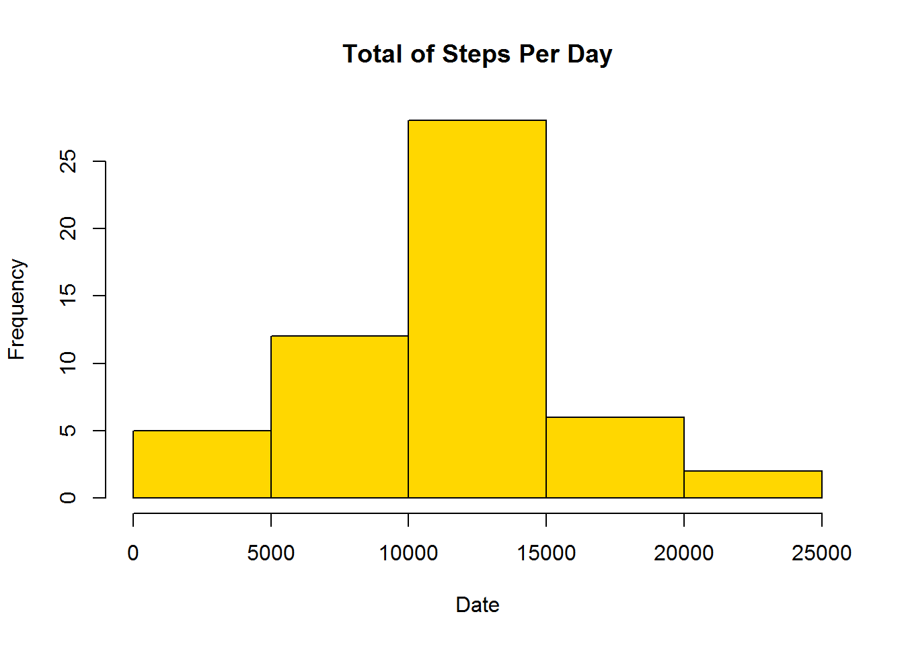

```{r setup, include=FALSE}
knitr::opts_chunk$set(echo = TRUE)
```

## Reproducible and Research Course

This is first project of reproducible and research course. The project is based on response questions about the dataset "Activity monitoring data". This dataset contains personal activity monitoring device. This device collects data at 5 minute intervals through out the day.


##Loading and preprocessing data
Show any code that is needed to


1. Load the data (i.e. read.csv())
```{r Load data}
library(plyr)
library(reshape2)
filezip <- "MotoringData.zip"

if(!file.exists(filezip))
	{
	fileUrl <- "https://d396qusza40orc.cloudfront.net/repdata%2Fdata%2Factivity.zip"
      download.file(fileUrl, destfile="MotoringData.zip", method ="auto")
	}

## Unzip the dataset
if (!file.exists("activity.csv")) 
	{ 
  	unzip("MotoringData.zip") 
	}

## read the table

Activity <- read.csv("activity.csv")

```


2. Process/transform the data (if necessary) into a format suitable for your analysis

```{r Process}
#Convert to date format
Activity$date <- as.Date(as.character(Activity$date), "%Y-%m-%d")

#Omit NA
Activity <- na.omit(Activity)
```

##What is mean total number of steps taken per day?

1. Calculate the total number of steps taken per day

```{r NumberStepsDay}
Number_Steps_PerDay <- aggregate(steps ~ date, data = Activity, FUN= sum)
Number_Steps_PerDay

```


2. If you do not understand the difference between a histogram and a barplot, research the difference between them. Make a histogram of the total number of steps taken each day
```{r histogram}
#Plot the histogram
hist(Number_Steps_PerDay$steps, col= "gold", main="Total of Steps Per Day", xlab ="Date")


```

3. Calculate and report the mean and median of the total number of steps taken per day
``` {r mediaAndMean}
#Media
Media_Per_Day <- mean(Number_Steps_PerDay$steps)
Media_Per_Day

#Median

Median_Per_Day <- median(Number_Steps_PerDay$steps)
Median_Per_Day
```


## What is the average daily activity pattern?

1. Make a time series plot (i.e. type = "l") of the 5-minute interval (x-axis) and the average number of steps taken, averaged across all days (y-axis)
```{r TimeSeries}

#Average of steps per day

Number_Steps_PerDay_Mean <- aggregate(steps ~ interval , data = Activity, FUN= mean)

#Plot type l
plot(Number_Steps_PerDay_Mean$interval, Number_Steps_PerDay_Mean$steps, type="l", main="The Average of Steps Per Day", ylab ="Number of  Steps", xlab ="Dates")

```


2. Which 5-minute interval, on average across all the days in the dataset, contains the maximum number of steps?

``` {r MaximunSteps}
#Maximun of step per day

positi <- which(Number_Steps_PerDay_Mean$steps== max(Number_Steps_PerDay_Mean$steps))

#Date of maximun

Number_Steps_PerDay_Mean[positi,1]

``` 

##Imputing missing values

1. Calculate and report the total number of missing values in the dataset (i.e. the total number of rows with NAs)
```{r nrows}
#Number Total NA

Activity <- read.csv("activity.csv")
NumberNA <- sum(is.na(Activity))
NumberNA

```

2. Devise a strategy for filling in all of the missing values in the dataset-

I replaced the NA's with 0.

3. Create a new dataset that is equal to the original dataset but with the missing data filled in

```{r replace}
#Replace the NA with 0

Activity <- read.csv("activity.csv")
Data_Dat_withOut_NA <- replace(Activity, is.na(Activity), 0)
```

4. Make a histogram of the total number of steps taken each day and Calculate and report the mean and median total number of steps taken per day. 

```{r medianReplace}
#Histogram with replace the NA with 0.
Number_Steps_PerDay_OutNA <- aggregate(steps ~ date, data = Data_Dat_withOut_NA, FUN= sum)
hist(Number_Steps_PerDay_OutNA$steps, col= "gold", main="Total of Steps Per Day without NA", xlab ="Date")

#Mean and Median without NA

Number_Steps_PerDay_Mean <- mean(Number_Steps_PerDay_OutNA$steps)
Number_Steps_PerDay_Mean
Number_Steps_PerDay_Median <- median(Number_Steps_PerDay_OutNA$steps)
Number_Steps_PerDay_Median
```

Clearly, the histograms with NA and with NA equal to 0 are different. In the same way, the media and median. The replace NA with other values affect the final result. 


##Are there differences in activity patterns between weekdays and weekends?

1. Create a new factor variable in the dataset with two levels - "weekday" and "weekend" indicating whether a given date is a weekday or weekend day.

```{r weekday}

#Merge a column a weekday or weekend
#Convert to date format

Data_Dat_withOut_NA$date <- as.Date(as.character(Data_Dat_withOut_NA$date), "%Y-%m-%d")
weekday <- weekdays(Data_Dat_withOut_NA$date)
Data_Dat_withOut_NA_days <- cbind(Data_Dat_withOut_NA,weekday) 

Data_Dat_withOut_NA_days$weekday <- gsub("lunes|martes|miércoles|jueves|viernes", "weekday", Data_Dat_withOut_NA_days$weekday)
Data_Dat_withOut_NA_days$weekday <- gsub("sábado|domingo", "weekend", Data_Dat_withOut_NA_days$weekday)
#Convert to factor
Data_Dat_withOut_NA_days$weekday <- factor(Data_Dat_withOut_NA_days$weekday)

```

2. Make a panel plot containing a time series plot (i.e. type = "l") of the 5-minute interval (x-axis) and the average number of steps taken, averaged across all weekday days or weekend days (y-axis)
```{r figures}
library(lattice)
Data_Total <- aggregate (steps ~ interval +weekday,data=Data_Dat_withOut_NA_days, mean)
xyplot(steps ~ interval| weekday, Data_Total,type="l", layout=c(1,2))
```


